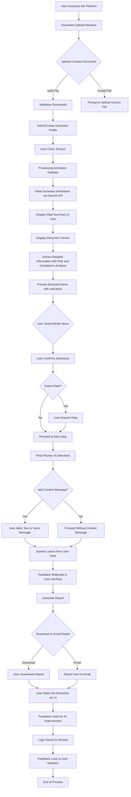

# Project Overview

## Problem Statement

In today's fast-paced business environment, professionals often face the daunting task of reviewing lengthy and complex contracts to extract critical information such as clauses, financial terms, obligations, compliance issues, and potential risks. This manual process is time-consuming, prone to human error, and can delay important decisions and negotiations. Additionally, the absence of intelligent tools for risk assessment, compliance checks, adaptive learning, and user guidance exacerbates the challenge. There is a pressing need for an efficient method to quickly distill essential details from contracts, identify potential risks, and provide insightful guidance—all while reducing the risk of overlooking vital information that could have significant legal and financial implications.

## High-Level Vision Statement

Our vision is to revolutionize the contract review process by creating an intelligent, intuitive, and user-centric platform that automates the extraction of key information from contracts. By incorporating advanced functionalities such as risk assessment indicators, compliance checks, adaptive learning, a terminology glossary, and in-app guidance, we aim to provide users with not just data but actionable insights. The platform simplifies and streamlines the contract analysis process into guided steps, enhanced with customizable extraction profiles and options for data export. Users can quickly obtain summaries, verify and edit extracted data, and add contextual insights with ease. Committed to privacy and data security, we focus on handling documents responsibly while building a knowledge base of contract structures and definitions to continuously improve the user experience and empower professionals to make informed decisions faster.

# Process Flow and Architecture

## Process Flow

### Overview

The contract extraction process is divided into several key steps to guide the user smoothly from uploading a contract to receiving a detailed report. The process is enhanced with additional functionalities for a more insightful and customized experience.

# Process Flow and Architecture (Updated)

## Process Flow

### Overview

The contract extraction process is divided into several key steps to guide the user smoothly from uploading a contract to receiving a detailed report. The process is enhanced with additional functionalities for a more insightful and customized experience, and now includes feedback loops towards the user interface.

### Step 1: Upload Contract Document and Profile Selection

1. **User Accesses the Platform**: The user navigates to the homepage of the contract extraction site.

2. **Document Upload Interface**: Presented with an intuitive interface enhanced with **in-app guidance and tooltips** to assist with navigation and usage.

3. **Uploading the Document**:
   - Users can upload a contract document in PDF or DOCX format.
   - Supports drag-and-drop functionality and traditional file browsing.

4. **Validation**:
   - The system validates the uploaded file for correct format and size.
   - Prompts the user if the file is invalid.

5. **Customizable Extraction Profiles** **(not now - NEXT VERSION)**:
   - Users select or create a custom extraction profile tailored to their specific needs (e.g., focusing on payment terms, delivery schedules).
   - Profiles can be saved for future use.

### Step 2: Initial Contract Extraction

6. **User Initiates Extraction**:
   - Clicking the "Extract" button begins the process.

7. **Processing Animation**:
   - An engaging animation indicates that the system is processing the document.

8. **Initial Summary Generation**:
   - Backend sends the document text to the OpenAI ChatGPT API, guided by the selected extraction profile.
   - Generates an initial summary (up to 2,500 characters).
   - There should be also an animation that as soon as I get the item from ChatGPT that it adds it into the summary (one at a time with animation)

9. **Display Initial Summary**:
   - System displays the initial summary with key terms linked to the **terminology glossary**.

### Step 3: Detailed Extraction Interface with Risk and Compliance Indicators

10. **Document Viewer Setup**:
    - Uploaded document displayed on the left side using a compatible viewer.

11. **Extraction of Detailed Information**:
    - System extracts detailed elements: clauses, terms, financial data, formulas.
    - **Risk Assessment Indicators** highlight potential risks.
    - **Compliance Checks and Alerts** notify of any regulatory issues.

12. **Presentation of Extracted Items with Indicators**:
    - Items presented in an organized list or table.
    - Visual cues (e.g., color-coded warnings) indicate risks and compliance issues.

13. **Terminology Glossary Integration** **(not now - NEXT VERSION)**:
    - Key terms linked to a glossary accessible via hover or click.

14. **In-App Guidance and Tooltips**:
    - Contextual help provided throughout the interface.

### Step 4: Editing, Confirmation, and Data Export Options

15. **User Edits Extracted Data**:
    - Inline editing of extracted items.
    - Users can make corrections, add annotations, or notes.

16. **Validation of Edits**:
    - Changes saved with real-time validation or suggestions.
    - Edits contribute to the **feedback loop for AI improvement**.

17. **Data Export Options (Optional)**:
    - Option to export data in formats like CSV, Excel, or JSON.

18. **Confirmation**:
    - Users confirm the validity of edited or selected items.

### Step 5: Final Validation, Context Attachment, and Learning

19. **Review Summary**:
    - Final summary presented for user review.

20. **Context Message Attachment**:
    - Option to add additional context via text or voice message.

21. **Learning and Adaptation** **(not now - NEXT VERSION)**:
    - System learns from user edits and feedback to improve future extractions.

22. **Feedback Reflected in User Interface**:
    - Updates or improvements based on user feedback are reflected in the user interface.
    - Users may notice enhanced suggestions, better accuracy, or new features in subsequent uses.

23. **Final Confirmation**:
    - User confirms to proceed to the next step.

### Step 6: Report Generation and Feedback

24. **Report Generation**:
    - Compiles selected and edited information into a comprehensive report.
    - Includes risk assessments, compliance alerts, and glossary references.

25. **Download and Email Options**:
    - Users can download the report or have it emailed.

26. **User Rating and Feedback**:
    - Prompted to rate the extraction process and provide feedback via the user interface.

27. **In-App Guidance for Next Steps**:
    - Suggestions provided based on the analysis (e.g., areas for renegotiation).

### Step 7: Post-Processing and Data Handling

28. **Data Anonymization and Storage**:
    - Documents are not stored permanently.
    - Anonymized metadata stored for knowledge base enhancement.

29. **Database Enhancement**:
    - Collected metadata enhances the database of contract definitions and structures.
    - **Terminology glossary** updated with new terms.

30. **Feedback Loop to User Interface**: 
    - Continuous improvement cycle where user feedback and data are used to enhance the user interface and system functionalities.

31. **Privacy Compliance**:
    - Data handling complies with privacy policies and regulations.

### Updated Process Flow Diagram

**Explanation:**

In the updated process flow diagram, I've added nodes and flows to represent the feedback loop towards the user interface:

- **W --> X[Feedback Reflected in User Interface]**: Shows that the system learns from user input, and the feedback is reflected back into the user interface.
  
- **AE --> AF[Feedback Loop to User Interface]**: Indicates that after logs are saved for review, the feedback loop continues towards the user interface for continuous improvement.

By including these nodes and flows, the diagram now accurately represents the feedback mechanisms and how they impact the user interface.

---

## **Section 3: System Architecture (Updated)**

### Overview

The system architecture consists of interconnected components that handle frontend presentation, backend processing, data storage, and external integrations. The architecture now explicitly includes feedback loops towards the user interface to illustrate how user feedback and system learning enhance the UI.

### Frontend Components

1. **User Interface (UI)**:
   - Responsive and intuitive design.
   - Enhanced with **in-app guidance and tooltips** for better user experience.
   - **Feedback Integration**: Reflects improvements based on user feedback and learning from the backend.

2. **Document Viewer**:
   - Displays uploaded documents with navigation features.
   - Supports both PDF and DOCX formats.

3. **Interactive Extraction Interface**:
   - Displays extracted items with options to select, edit, and confirm.
   - Shows **risk assessment indicators** and **compliance alerts** using visual cues.
   - Updates dynamically based on feedback and learning.

4. **Terminology Glossary Interface**:
   - Provides definitions for key terms via hover or click.
   - Glossary content updated based on backend enhancements.

5. **Voice Input Interface**:
   - Allows users to record voice messages.
   - Converts voice input to text for inclusion in the context message.

6. **Visualization Module**:
   - Renders contract structure diagrams using **Mermaid.js**.
   - Helps users visualize the flow and hierarchy within the contract.

7. **Feedback Collection Interface**:
   - Facilitates user ratings and feedback submissions.
   - Integrated seamlessly into the UI for ease of use.

### Backend Components

1. **Web Framework**:
   - **Django** handles URL routing, views, and template rendering.
   - Manages session and state management securely.

2. **API Integration Module**:
   - Integrates with **OpenAI ChatGPT API** for summaries and extractions.
   - Uses **Voice-to-Text Service** for processing voice messages.

3. **Data Processing and Extraction Module**:
   - Processes uploaded documents.
   - Extracts relevant information using AI/NLP models.
   - Incorporates **risk and compliance analysis**.

4. **Terminology Glossary Module**:
   - Manages a database of procurement and legal terms.
   - Updates glossary based on new terms from processed contracts.

5. **Profile Management Module**:
   - Manages customizable extraction profiles.
   - Allows users to create, save, and select profiles.

6. **Asynchronous Task Queue**:
   - Uses **Celery** with a message broker like Redis or RabbitMQ.
   - Handles long-running tasks such as API calls and report generation.

7. **Database**:
   - **PostgreSQL** or **MySQL** stores metadata, logs, glossary terms, and profiles.
   - Ensures data integrity and security.

8. **File Handling Module**:
   - Manages secure temporary storage of uploaded documents.
   - Ensures documents are deleted after processing.

9. **Report Generation Module**:
   - Compiles selected and edited data into a formatted report.
   - Includes risk assessments, compliance alerts, and glossary references.

10. **Data Export Module**:
    - Enables data export in various formats (CSV, Excel, JSON).
    - Provides flexibility for further analysis or reporting.

11. **Email Service**:
    - Sends reports to user-specified email addresses.
    - Handles email templates and delivery status.

12. **Logging and Monitoring Module**:
    - Records user actions, errors, and system performance metrics.
    - Provides data for administrative review and system improvement.

13. **Feedback and AI Training Module**:
    - Collects user feedback and edits.
    - Uses data to improve AI models through machine learning.
    - **Feedback Loop to UI**: Enhances the user interface based on learning outcomes.

14. **Privacy and Compliance Module**:
    - Ensures compliance with data protection regulations like GDPR.
    - Manages user consents and data handling policies.

### External Services and Integrations

1. **OpenAI ChatGPT API**:
   - Used for generating initial summaries and detailed extractions.
   - Requires careful management of API keys and adherence to usage policies.

2. **Voice-to-Text API**:
   - Converts user voice messages into text.
   - Options include services like Google Cloud Speech-to-Text.

3. **Mermaid.js**:
   - Renders diagrams based on data from the backend.
   - Enhances understanding of contract structures.

### Security and Compliance

1. **Data Security**:
   - SSL/TLS encryption for data in transit.
   - Secure handling and storage of sensitive data.
   - Regular security audits and updates.

2. **User Authentication and Authorization**:
   - Manages user accounts and permissions.
   - Supports multi-factor authentication (MFA).

3. **Privacy Compliance**:
   - Adheres to privacy laws and regulations.
   - Provides transparent privacy policies to users.

### Deployment and Scalability

1. **Hosting Environment**:
   - Options include cloud services like AWS, Azure, or Heroku.
   - Scalable infrastructure to handle variable workloads.

2. **Containerization and Orchestration**:
   - Uses **Docker** and **Kubernetes** for deployment.
   - Simplifies scaling and management of application components.

3. **Continuous Integration/Continuous Deployment (CI/CD)**:
   - Automates testing, integration, and deployment processes.
   - Utilizes tools like Jenkins, GitHub Actions, or GitLab CI/CD.

## System Architecture

### Overview

The system architecture consists of interconnected components that handle frontend presentation, backend processing, data storage, and external integrations. The architecture is designed to incorporate the new functionalities seamlessly.

### Frontend Components

1. **User Interface (UI)**:
   - Responsive and intuitive design.
   - Enhanced with **in-app guidance and tooltips** for better user experience.

2. **Document Viewer**:
   - Displays uploaded documents with navigation features.
   - Supports both PDF and DOCX formats.

3. **Interactive Extraction Interface**:
   - Displays extracted items with options to select, edit, and confirm.
   - Shows **risk assessment indicators** and **compliance alerts** using visual cues.

4. **Terminology Glossary Interface**:
   - Provides definitions for key terms via hover or click.
   - Enhances understanding of complex legal and procurement terms.

5. **Voice Input Interface**:
   - Allows users to record voice messages.
   - Converts voice input to text for inclusion in the context message.

6. **Visualization Module**:
   - Renders contract structure diagrams using **Mermaid.js**.
   - Helps users visualize the flow and hierarchy within the contract.

### Backend Components

1. **Web Framework**:
   - **Django** handles URL routing, views, and template rendering.
   - Manages session and state management securely.

2. **API Integration Module**:
   - Integrates with **OpenAI ChatGPT API** for summaries and extractions.
   - Uses **Voice-to-Text Service** for processing voice messages.

3. **Data Processing and Extraction Module**:
   - Processes uploaded documents.
   - Extracts relevant information using AI/NLP models.
   - Incorporates **risk and compliance analysis**.

4. **Terminology Glossary Module**:
   - Manages a database of procurement and legal terms.
   - Updates glossary based on new terms from processed contracts.

5. **Profile Management Module**:
   - Manages customizable extraction profiles.
   - Allows users to create, save, and select profiles.

6. **Asynchronous Task Queue**:
   - Uses **Celery** with a message broker like Redis or RabbitMQ.
   - Handles long-running tasks such as API calls and report generation.

7. **Database**:
   - **PostgreSQL** or **MySQL** stores metadata, logs, glossary terms, and profiles.
   - Ensures data integrity and security.

8. **File Handling Module**:
   - Manages secure temporary storage of uploaded documents.
   - Ensures documents are deleted after processing.

9. **Report Generation Module**:
   - Compiles selected and edited data into a formatted report.
   - Includes risk assessments, compliance alerts, and glossary references.

10. **Data Export Module**:
    - Enables data export in various formats (CSV, Excel, JSON).
    - Provides flexibility for further analysis or reporting.

11. **Email Service**:
    - Sends reports to user-specified email addresses.
    - Handles email templates and delivery status.

12. **Logging and Monitoring Module**:
    - Records user actions, errors, and system performance metrics.
    - Provides data for administrative review and system improvement.

13. **Feedback and AI Training Module**:
    - Collects user feedback and edits.
    - Uses data to improve AI models through machine learning.

14. **Privacy and Compliance Module**:
    - Ensures compliance with data protection regulations like GDPR.
    - Manages user consents and data handling policies.

### External Services and Integrations

1. **OpenAI ChatGPT API**:
   - Used for generating initial summaries and detailed extractions.
   - Requires careful management of API keys and adherence to usage policies.

2. **Voice-to-Text API**:
   - Converts user voice messages into text.
   - Options include services like Google Cloud Speech-to-Text.

3. **Mermaid.js**:
   - Renders diagrams based on data from the backend.
   - Enhances understanding of contract structures.

### Security and Compliance

1. **Data Security**:
   - SSL/TLS encryption for data in transit.
   - Secure handling and storage of sensitive data.
   - Regular security audits and updates.

2. **User Authentication and Authorization**:
   - Manages user accounts and permissions.
   - Supports multi-factor authentication (MFA).

3. **Privacy Compliance**:
   - Adheres to privacy laws and regulations.
   - Provides transparent privacy policies to users.

### Deployment and Scalability

1. **Hosting Environment**:
   - Options include cloud services like AWS, Azure, or Heroku.
   - Scalable infrastructure to handle variable workloads.

2. **Containerization and Orchestration**:
   - Uses **Docker** and **Kubernetes** for deployment.
   - Simplifies scaling and management of application components.

3. **Continuous Integration/Continuous Deployment (CI/CD)**:
   - Automates testing, integration, and deployment processes.
   - Utilizes tools like Jenkins, GitHub Actions, or GitLab CI/CD.

# Technology Stack and Data Flow

## Potential Technology Stack

- **Frontend**:
  - **HTML5**, **CSS3**, **JavaScript**
  - Frameworks: **React** or **Vue.js** for a dynamic and responsive UI
  - Libraries:
    - **PDF.js** for document viewing
    - **Mermaid.js** for rendering diagrams
    - **Quill.js** or **Draft.js** for rich text editing
    - **Web Speech API** for voice input functionality
    - **Intro.js** for in-app guidance and tooltips

- **Backend**:
  - **Django** and **Django REST Framework** for building robust APIs
  - **Celery** for asynchronous task management
  - Database: **PostgreSQL** or **MySQL** for reliable data storage
  - **Machine Learning Frameworks**: **TensorFlow** or **PyTorch** for AI model training and adaptation
  - External APIs:
    - **OpenAI ChatGPT API** for natural language processing tasks
    - **Voice-to-Text API** for converting voice messages to text

- **DevOps and Deployment**:
  - **Docker** for containerization
  - **Kubernetes** for orchestration and scalability
  - **CI/CD Tools**: Jenkins, **GitHub Actions**, or **GitLab CI/CD** for automated deployment
  - Hosting Platforms: **AWS**, **Azure**, **Heroku**, or **DigitalOcean**

## Data Flow Summary

1. **User Interaction**:
   - The user uploads a document and selects an extraction profile.
   - User actions are securely transmitted to the backend.

2. **Backend Processing**:
   - The document and user settings are received by the Django backend.
   - An asynchronous task is initiated using Celery to process the extraction.

3. **Data Exchange with External APIs**:
   - The document text is sent to the OpenAI ChatGPT API for initial summary and detailed extraction.
   - Risk assessment and compliance checks are performed.
   - Voice messages (if any) are processed via the Voice-to-Text API.

4. **Data Presentation**:
   - Extracted data, along with risk indicators and compliance alerts, are sent back to the frontend.
   - The frontend displays the data, incorporating the terminology glossary and in-app guidance.

5. **User Edits and Feedback**:
   - User edits and confirmations are captured and sent to the backend.
   - The **Feedback and AI Training Module** uses this data to improve AI models.

6. **Data Export and Report Generation**:
   - Upon confirmation, data can be exported in various formats.
   - The **Report Generation Module** compiles the final report, including all insights.

7. **Delivery and User Feedback**:
   - The report is delivered via download or email.
   - Users provide ratings and feedback on the extraction process.

8. **Logging and Data Storage**:
   - User actions and system events are logged for monitoring.
   - Anonymized metadata is stored for knowledge base enhancement.
   - Original documents are deleted post-processing to ensure privacy.
